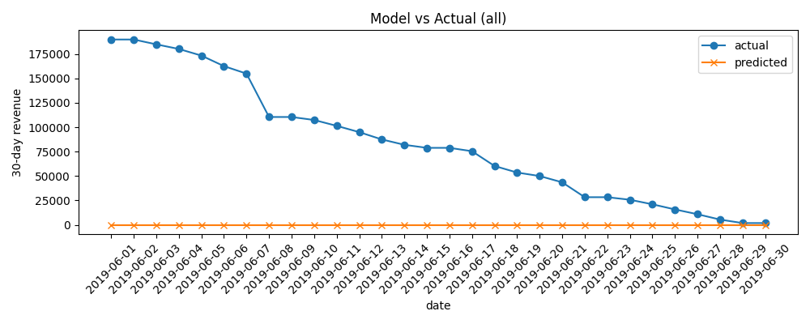

# Solution for *AI in Production*

## 1. Running the application
To start this application run the following command:
```
python app.py
```
and navigate to the following url: [http://localhost:5000](http://localhost:5000)

**NOTE:** it might take a minute to respond the first time

## 2. Running tests
**NOTE:** Before running the unit tests, make sure the previous command is running

To run all the tests (summary style):
```
python run-tests.py
```
To run all the test (verbose style):
```
python run-tests.py -v
```
```markdown
# AI-Workflow-Capstone

This repository contains a small Flask-based API and supporting model code for training
and predicting time-series invoice volumes by country. It was developed as part of the
"AI in Production" style workflow and includes training, prediction, logging, and tests.

**Status:** development / educational

**Layout (important files)**
- `app.py` : Flask API exposing `/train`, `/predict` and `/logs/<logname>` endpoints.
- `model.py` : data ingestion, feature engineering and model training/prediction helpers.
- `cslib.py` : dataset loading and feature engineering utilities.
- `logger.py` : writes newline-delimited JSON logs to `logs/` and `logs-test/`.
- `requirements.txt` : Python dependencies.
- `run_tests.py` : wrapper to run the test suite via `pytest`.
- `models/` : directory where trained models are saved (joblib files).
- `data/` : example CSV/JSON training and production data used by `cslib`.

## Requirements
Install dependencies (recommended inside a virtualenv):

```powershell
python -m pip install -r requirements.txt
```

## Running the API locally
Start the Flask app:

```powershell
python app.py
```

By default the server listens on `http://0.0.0.0:5000`.

### API Endpoints
- `POST /train` : trigger training of per-country models.
	- JSON body options:
		- `test` (boolean) : run training in test mode (subsets data and writes logs to `logs-test/`).
		- `data_dir` (string) : optional path to the training data directory.
	- Example:

```powershell
curl -X POST http://localhost:5000/train -H "Content-Type: application/json" -d '{"test": true}'
```

- `GET /predict?country=<country>&year=<YYYY>&month=<MM>&day=<DD>` : return prediction for a specific date.
	- Example:

```powershell
curl "http://localhost:5000/predict?country=all&year=2018&month=01&day=05"
```

- `GET /logs/<logname>` : returns the last ~20 entries from the named log (`predict` or `train`).
	- Example: `GET /logs/predict` reads `logs/predict_log.jsonl`.

## Training models (CLI)
You can also train models directly via Python using `model.model_train`:

```powershell
python -c "import model; model.model_train('data/cs-train', test=True)"
```

Trained models are saved into the `models/` directory. Production models use the
`sl-<country>-<version>.joblib` naming convention; test models are prefixed with `test-`.

## Logs
- Training and prediction events are written as newline-delimited JSON (`*.jsonl`) to:
	- production: `logs/train_log.jsonl` and `logs/predict_log.jsonl`
	- test runs: `logs-test/train_log.jsonl` and `logs-test/predict_log.jsonl`

## Tests
Run the test suite with `pytest` via the helper script:

```powershell
python run_tests.py
```

The repository includes unit tests for the API, model logic, logging, and helper libraries
in the `tests/` directory.

## Docker (optional)
Build and run the included Dockerfile:

```powershell
docker build -t ai-workflow-capstone .
docker run -p 5000:5000 ai-workflow-capstone
```

## Data
Example time-series data is stored in `data/cs-train/` (training) and
`data/cs-production/` (production-like). The `cslib.fetch_ts` helper reads these files
and prepares per-country time-series tables used by `model.py`.

## Reports

A model vs actual plot is generated by `scripts/generate_model_vs_actual.py` and saved to the `reports/` folder. Example output:



The script also writes a small JSON metrics file next to the image (for example `reports/model_vs_actual_all.json`) containing `country`, `pairs`, and `rmse`.

## Notes & Troubleshooting
- If `models/` or `logs/` directories are missing, the code will create them when needed.
- Ensure `data_dir` paths exist when calling `/train` or `model.model_train`.
- If `joblib` cannot deserialize saved models between Python versions, retrain and re-save.

## Contributing
If you want changes or fixes, open an issue or submit a PR describing the change.

---
```
